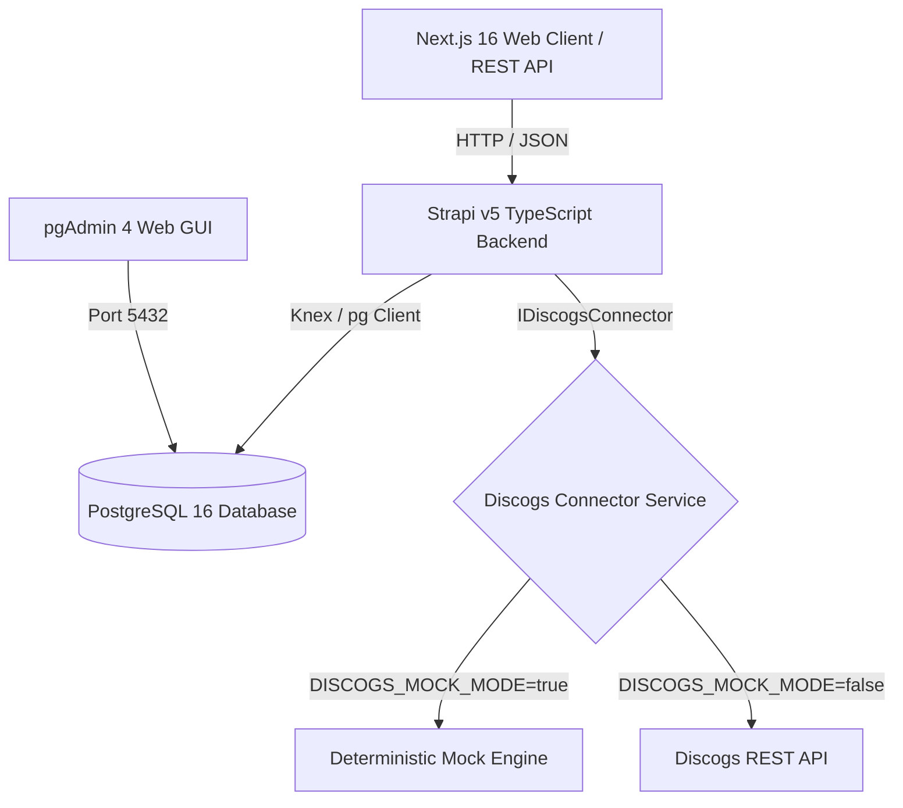

# 🎵 Vinyl Marketplace & Discogs Sync Platform (Multi-Tenant MVP)

[](https://www.typescriptlang.org/)
[](https://strapi.io/)
[](https://nextjs.org/)
[](https://www.postgresql.org/)
[](https://www.docker.com/)

> A robust, production-grade backoffice and integration platform designed to manage collectible **Vinyl records** and automate synchronization workflows with the **Discogs Marketplace**.

---

## 📑 Table of Contents

- [1. System Architecture](#1-system-architecture)
- [2. Technology Stack](#2-technology-stack)
- [3. Prerequisites](#3-prerequisites)
- [4. Quick Start Guide](#4-quick-start-guide)
- [5. Environment Configuration](#5-environment-configuration)
- [6. Service Access & Credentials](#6-service-access--credentials)
- [7. Domain Models & Multi-Tenancy](#7-domain-models--multi-tenancy)
- [8. End-to-End Test Walkthrough & API Endpoints](#8-end-to-end-test-walkthrough--api-endpoints)
- [9. Discogs Marketplace Connector](#9-discogs-marketplace-connector)
- [10. Code Quality & Testing](#10-code-quality--testing)
- [11. Maintenance & Useful Commands](#11-maintenance--useful-commands)

---

## 1. System Architecture

The application is structured into decoupled, modular layers with strict tenant scoping, automatic SKU generation, mockable external integrations, and persistent synchronization audit logging.

```
test-tech-overload/
├── backend/                  # Strapi v5 Headless CMS (TypeScript strict mode)
│   ├── config/               # Database, server & middleware configurations
│   ├── src/
│   │   ├── api/              # Content-types (Tenant, Product, SellableUnit, etc.)
│   │   └── services/         # Marketplace Connector Layer (Discogs Mock/Real)
│   └── .env.example          # Backend & Database configuration template
├── frontend/                 # Next.js 16 Client (App Router + Tailwind CSS)
│   └── .env.example          # Frontend configuration template
├── docker-compose.yml        # PostgreSQL 16 & pgAdmin 4 (Dev / Prod profiles)
├── package.json              # Monorepo root workspace configuration (npm workspaces)
├── .prettierrc               # Universal code formatting rules (LF line endings)
├── .gitattributes            # Cross-OS Git line-ending normalization
├── .gitignore                # Comprehensive root Git exclusions
└── README.md                 # Technical documentation & test instructions
```



---

## 2. Technology Stack

- **Backend Framework**: [Strapi v5](https://strapi.io/) with full **TypeScript** support
- **Frontend Framework**: [Next.js 16](https://nextjs.org/) (React 19, App Router, Turbopack)
- **Database Engine**: [PostgreSQL 16](https://www.postgresql.org/) (Containerized)
- **Database Administration**: [pgAdmin 4](https://www.pgadmin.org/) (Containerized)
- **Containerization**: [Docker & Docker Compose](https://docs.docker.com/compose/) with `dev` & `prod` profiles

---

## 3. Prerequisites

Ensure you have the following installed on your host machine:

- **Node.js**: `v20.0.0` or higher
- **npm**: `v9.0.0` or higher
- **Docker & Docker Compose**: `v20.10+`

---

## 4. Quick Start Guide

Follow these steps to run the complete environment locally:

### 1️⃣ Initialize Environment Files

Copy the environment templates:

```bash
# Backend & Database Configuration (Strapi + Docker PostgreSQL + pgAdmin)
cp backend/.env.example backend/.env

# Frontend Configuration (Next.js)
cp frontend/.env.example frontend/.env.local
```

### 2️⃣ Install All Dependencies (Monorepo Root)

```bash
npm install
```

### 3️⃣ Start Database Services (PostgreSQL & pgAdmin)

```bash
npm run docker:up
# (Equivalent to: docker compose --profile dev up -d)
```

> Verify containers are healthy: `docker compose ps`

### 4️⃣ Launch the Application

#### Option A: Launch Both Services Concurrently (Recommended)

```bash
npm run dev
```

> Starts Strapi backend on **[http://localhost:1337](http://localhost:1337)** and Next.js frontend on **[http://localhost:3000](http://localhost:3000)** simultaneously with synchronized color logs.

#### Option B: Launch Services Individually

```bash
# In Terminal 1 - Backend Strapi
npm run dev:backend

# In Terminal 2 - Frontend Next.js
npm run dev:frontend
```

> On your first visit to **[http://localhost:1337/admin](http://localhost:1337/admin)**, follow the prompt to create your local administrator credentials.

---

## 5. Environment Configuration

### 🛠️ Backend & Database Configuration (`backend/.env` & `backend/.env.example`)

_Shared between Strapi v5 and Docker Compose._

| Variable Name              | Description                                   | Default Value             |
| :------------------------- | :-------------------------------------------- | :------------------------ |
| `DATABASE_CLIENT`          | Database client (`postgres`)                  | `postgres`                |
| `DATABASE_HOST`            | Database host (local)                         | `127.0.0.1`               |
| `DATABASE_PORT`            | Port exposed to host machine                  | `5432`                    |
| `DATABASE_NAME`            | PostgreSQL database name                      | `strapi_vinyle_db`        |
| `DATABASE_USERNAME`        | PostgreSQL user                               | `strapi_user`             |
| `DATABASE_PASSWORD`        | PostgreSQL password                           | `strapi_password`         |
| `PGADMIN_PORT`             | pgAdmin web interface port                    | `5050`                    |
| `PGADMIN_DEFAULT_EMAIL`    | pgAdmin login email                           | `admin@admin.com`         |
| `PGADMIN_DEFAULT_PASSWORD` | pgAdmin login password                        | `admin`                   |
| `HOST` / `PORT`            | Strapi server binding                         | `0.0.0.0` / `1337`        |
| `APP_KEYS`                 | Application cryptographic keys                | _(Auto-generated base64)_ |
| `ADMIN_JWT_SECRET`         | Admin authentication JWT secret               | _(Auto-generated base64)_ |
| `JWT_SECRET`               | Users-permissions JWT secret                  | _(Auto-generated base64)_ |
| `DISCOGS_MOCK_MODE`        | Enable offline deterministic mock mode        | `true`                    |
| `DISCOGS_API_TOKEN`        | Discogs personal access token (Real API mode) | `""`                      |

### 🌐 Frontend Configuration (`frontend/.env.local` & `frontend/.env.example`) — _Next.js Client_

| Variable Name                | Description                           | Default Value           |
| :--------------------------- | :------------------------------------ | :---------------------- |
| `NEXT_PUBLIC_STRAPI_API_URL` | Strapi backend URL for Next.js client | `http://localhost:1337` |

---

## 6. Service Access & Credentials

| Service                      | Access URL                                                 | Default Credentials         |
| :--------------------------- | :--------------------------------------------------------- | :-------------------------- |
| **Strapi Admin Panel**       | [http://localhost:1337/admin](http://localhost:1337/admin) | Created upon initial setup  |
| **Strapi REST API**          | [http://localhost:1337/api](http://localhost:1337/api)     | API Token or Bearer JWT     |
| **pgAdmin 4 (Database GUI)** | [http://localhost:5050](http://localhost:5050)             | `admin@admin.com` / `admin` |
| **Next.js Web App**          | [http://localhost:3000](http://localhost:3000)             | Public Web Application      |

### Connecting pgAdmin to PostgreSQL

1. Open [http://localhost:5050](http://localhost:5050) and log in.
2. In the left panel, right-click **Servers** > **Register** > **Server...**.
3. Under the **General** tab: Name = `Vinyl Postgres Dev`.
4. Under the **Connection** tab:
   - **Host name/address**: `vinyle_postgres_dev` _(or `host.docker.internal`)_
   - **Port**: `5432`
   - **Maintenance database**: `strapi_vinyle_db`
   - **Username**: `strapi_user`
   - **Password**: `strapi_password`
5. Click **Save**.

---

## 7. Domain Models & Multi-Tenancy

Every domain entity is strictly scoped to a **`tenantId`** to prevent data cross-contamination:

1. **`Tenant`**
   - Multi-tenant boundary (`name`, `slug` [unique], `isActive` [boolean]).
2. **`Product` (Vinyl Master Record)**
   - Represents the catalog reference (`tenant`, `productType: 'vinyl'`, `title`, `artist`, `year`, `label`, `country`, `format`, `barcode`, `discogsReleaseId`, `discogsMasterId`).
3. **`SellableUnit` (Physical Inventory Unit)**
   - Represents a specific physical copy (`tenant`, `product`, `sku` [auto-generated format `VIN-000001`], `price`, `currency: 'EUR'`, `discCondition`, `sleeveCondition`, `sellerNotes`, `status: available | reserved | sold | out_of_stock | archived`, `quantity`).
4. **`ChannelListing` (Marketplace State)**
   - Marketplace synchronization state (`tenant`, `sellableUnit`, `channel: 'discogs'`, `externalListingId`, `externalUrl`, `status: not_published | pending | published | failed | removed | sync_error`, `publishedPrice`, `lastSyncedAt`, `lastErrorMessage`).
5. **`MarketplaceSyncEvent` (Audit Logs)**
   - Persistent, queryable audit trail (`tenant`, `channel: 'discogs'`, `action: search_release | check_completeness | publish_listing | mark_out_of_stock`, `status: success | failed | pending`, `product`, `sellableUnit`, `channelListing`, `message`, `payload`, `timestamp`).

---

## 8. End-to-End Test Walkthrough & API Endpoints

Execute the complete vinyl lifecycle from catalog creation to marketplace sale:

### Step 1: Create a Tenant

```bash
curl -X POST http://localhost:1337/api/tenants \
  -H "Content-Type: application/json" \
  -d '{
    "data": {
      "name": "Disquaire Parisien",
      "slug": "disquaire-paris",
      "isActive": true
    }
  }'
```

### Step 2: Search Discogs for Release Metadata

```bash
curl -X GET "http://localhost:1337/api/discogs/search?tenantId=1&q=Discovery+Daft+Punk"
```

_Returns deterministic mock data: Release ID `123456`, Daft Punk - Discovery (2001, Virgin, France)._

### Step 3: Create Catalog Product Attached to Discogs

```bash
curl -X POST http://localhost:1337/api/products \
  -H "Content-Type: application/json" \
  -d '{
    "data": {
      "tenant": 1,
      "productType": "vinyl",
      "title": "Discovery",
      "artist": "Daft Punk",
      "year": 2001,
      "label": "Virgin",
      "country": "France",
      "format": "2xLP",
      "discogsReleaseId": "123456"
    }
  }'
```

### Step 4: Create a Sellable Unit (Automatic SKU Generation)

```bash
curl -X POST http://localhost:1337/api/sellable-units \
  -H "Content-Type: application/json" \
  -d '{
    "data": {
      "tenant": 1,
      "product": 1,
      "price": 34.99,
      "currency": "EUR",
      "discCondition": "Very Good Plus",
      "sleeveCondition": "Near Mint",
      "sellerNotes": "Original pressing, very clean copy",
      "quantity": 1
    }
  }'
```

_Backend automatically generates `sku: "VIN-000001"` and sets initial `status: "available"`._

### Step 5: Validate Completeness for Discogs Publication

```bash
curl -X POST http://localhost:1337/api/sellable-units/1/check-discogs-completeness \
  -H "Content-Type: application/json"
```

_Verifies tenant isolation, disc condition, price validity, and Discogs Release ID._

### Step 6: Publish Listing to Discogs

```bash
curl -X POST http://localhost:1337/api/sellable-units/1/publish-discogs \
  -H "Content-Type: application/json"
```

_Creates a `ChannelListing` with `externalListingId: "discogs-listing-0001"` and logs a `success` event in `MarketplaceSyncEvent`._

### Step 7: Simulate Marketplace Sale

```bash
curl -X POST http://localhost:1337/api/sellable-units/1/simulate-discogs-sale \
  -H "Content-Type: application/json"
```

_Transitions the inventory unit status to `sold`, decrements stock, and creates an audit entry in `MarketplaceSyncEvent`._

---

## 9. Discogs Marketplace Connector

The connector adheres to **SOLID principles** via the `IDiscogsConnector` interface:

- **Mock Mode (Default: `DISCOGS_MOCK_MODE=true`)**: Provides fast, deterministic, reproducible responses for development and automated tests without requiring external network connectivity or Discogs credentials.
- **Live API Mode (`DISCOGS_MOCK_MODE=false`)**: Authenticates via `DISCOGS_API_TOKEN` and connects to `https://api.discogs.com`.

---

## 10. Code Quality & Testing

### TypeScript Verification & Linting (Unified Workspace)

Run type checking and linting across the entire monorepo with a single command:

```bash
# Check TypeScript types and ESLint across all workspaces
npm run check

# Check Prettier code formatting
npm run format:check

# Auto-format all source code
npm run format

# Compile production bundles for both Backend and Frontend
npm run build
```

### Individual Service Checks

```bash
# Backend only
npm run check --workspace=backend

# Frontend only
npm run check --workspace=frontend
```

---

## 11. Maintenance & Useful Commands

```bash
# Start Docker database services
npm run docker:up

# Stop all Docker containers
npm run docker:down

# Stop and wipe persistent database volumes (reset database)
docker compose --profile dev down -v

# View live database container logs
docker compose logs -f postgres-dev
```

---

## 📄 License

This project is delivered as a technical benchmark MVP and is private and proprietary.
